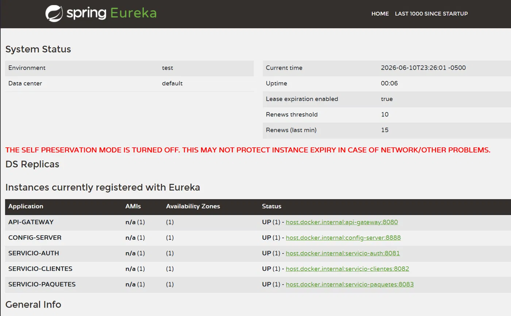

# RapidoCourier S.A.C. - Sistema de Microservicios

## Mapa de Microservicios

| Servicio | Bounded Context | RFs Asignados | Base de Datos | Puerto |
|---|---|---|---|---|
| eureka-server | Registro y descubrimiento | — | — | 8761 |
| config-server | Configuración centralizada | — | — | 8888 |
| api-gateway | Enrutamiento y trazabilidad | — | — | 8080 |
| servicio-auth | Identidad y acceso | RF-08 | H2 (authdb) | 8081 |
| servicio-clientes | Gestión de clientes, integración RENIEC | RF-01 | H2 (clientesdb) | 8082 |
| servicio-paquetes | Logística de paquetes | RF-02 al RF-07, RF-09 | H2 (paquetesdb) | 8083 |

## Diagrama de Dependencias Inter-Servicio

```
Cliente externo
     │
     ▼
[api-gateway :8080]  ──── GlobalFilter TraceabilityFilter (X-Request-Id, X-Gateway-Timestamp)
     │
     ├──► lb://servicio-auth    (:8081)  ◄── HashiCorp Vault (JWT_SECRET)
     │
     ├──► lb://servicio-clientes (:8082) ──► RENIEC API externa (Feign + CircuitBreaker)
     │         ▲
     │         │  Feign (lb://servicio-clientes) — enriquece nombres en response
     │
     └──► lb://servicio-paquetes (:8083)

Todos los servicios se registran en: [eureka-server :8761]
Todos obtienen config de:            [config-server :8888]
```

| Llamante | Destino | Tipo | Propósito |
|---|---|---|---|
| servicio-clientes | RENIEC (externa) | Sincrónica Feign | Obtener nombre completo al registrar cliente |
| servicio-paquetes | servicio-clientes | Sincrónica Feign + CircuitBreaker | Enriquecer respuesta con nombres de remitente/destinatario |
| servicio-auth | HashiCorp Vault | Sincrónica Spring Cloud Vault | Leer clave de firma JWT |

---

## Modelo de Datos por Servicio

### servicio-auth
- **Usuario**: id (UUID), email, password, nombre, activo, createdAt, updatedAt
- **Rol**: id (UUID), nombre (ADMIN/OPERADOR/CLIENTE)
- **Relación**: Usuario ↔ Rol (ManyToMany vía `usuario_roles`)

### servicio-clientes
- **Cliente**: id (UUID), dni, nombreCompleto, email, telefono, direccion, activo, createdAt, updatedAt

### servicio-paquetes
- **Paquete**: id (UUID), codigoRastreo, remitenteId, destinatarioId, sucursalOrigen, sucursalDestino, pesoKg, distanciaKm, tarifa, descripcion, estado, createdAt, updatedAt
- **HistorialEstado**: id (UUID), paquete (FK), estadoAnterior, estadoNuevo, usuarioEmail, observacion, fechaCambio
- **Categoria**: id (UUID), nombre, descripcion
- **Relación**: Paquete ↔ Categoria (ManyToMany vía `paquete_categorias`)
- **Relación**: Paquete → HistorialEstado (OneToMany)

---

## Regla de Cálculo de Tarifa (RF-03)

Variables consideradas: **peso en kg** y **distancia en km**.  
El **valor declarado** (en soles) también se registra en el paquete pero no entra en la fórmula base;
sirve como referencia para seguros y se almacena en `valorDeclarado`.

```
tarifa = (pesoKg × 2.50) + (distanciaKm × 0.10)
tarifa_final = max(tarifa, 5.00)   // tarifa mínima S/. 5.00
```

**Ejemplo**: 5 kg, 100 km → (5 × 2.50) + (100 × 0.10) = 12.50 + 10.00 = **S/. 22.50**

Los valores `por-kg`, `por-km` y `minima` se obtienen del Config Server (propiedad `tarifa.base.*`)
y soportan recarga en caliente con `@RefreshScope`.

---

## Estados y Transiciones de Paquete (RF-04)

```
REGISTRADO ──► EN_ALMACEN ──► EN_TRANSITO ──► EN_DESTINO ──► ENTREGADO
     │               │               │
     └──────────────►└──────────────►└──────────────► CANCELADO
```

| Estado Actual | Transiciones Permitidas |
|---|---|
| REGISTRADO | EN_ALMACEN, CANCELADO |
| EN_ALMACEN | EN_TRANSITO, CANCELADO |
| EN_TRANSITO | EN_DESTINO, CANCELADO |
| EN_DESTINO | ENTREGADO |
| ENTREGADO | (ninguna) |
| CANCELADO | (ninguna) |

Una transición no permitida lanza `InvalidTransitionException` → HTTP 409.

---

## Control de Acceso (RF-08)

| Rol | Permisos |
|---|---|
| **ADMIN** | Todo: registro, actualización, eliminación, consultas |
| **OPERADOR** | Registrar clientes, registrar paquetes, actualizar estado, consultas |
| **CLIENTE** | Consultar paquetes e historial (solo lectura) |

---

## Justificación de BD y Arquitectura

Se usa **H2 en memoria** para desarrollo: cada microservicio tiene su propia base de datos aislada,
respetando el principio de *Database per Service*. En producción se reemplazaría por PostgreSQL.

Comunicación **sincrónica** (Feign) justificada porque:
- El registro de clientes requiere la respuesta de RENIEC **en tiempo real** para validar el DNI.
- La consulta de datos de cliente al crear un paquete es un enriquecimiento de respuesta inmediato.

---

## Instrucciones de Arranque Local

### Requisitos
- Java 17+, Maven 3.8+
- Variable de entorno: `JWT_SECRET` (mínimo 32 caracteres)
- Variable de entorno: `RENIEC_TOKEN` (token de la API de decolecta)
- Repositorio Git local de configuración (ver sección **Config Server con repositorio Git**) — debe existir **antes** de arrancar el config-server

### Orden de arranque (importante)

```bash
# 1. Eureka Server (registro de servicios)
cd eureka-server && mvn spring-boot:run

# 2. Config Server (configuración centralizada)
cd config-server && mvn spring-boot:run

# 3. API Gateway
cd api-gateway && mvn spring-boot:run

# 4. Servicios de negocio (en cualquier orden)
cd servicio-auth     && mvn spring-boot:run
cd servicio-clientes && mvn spring-boot:run
cd servicio-paquetes && mvn spring-boot:run
```

### Variables de entorno (PowerShell)
```powershell
$env:JWT_SECRET = "<tu-secreto-de-al-menos-32-caracteres>"
$env:RENIEC_TOKEN = "tu-token-de-reniec"
```

---

## Casos de Prueba curl (via Gateway en localhost:8080)

### 1. Registrar usuario ADMIN
```bash
curl -X POST http://localhost:8080/api/v1/auth/register \
  -H "Content-Type: application/json" \
  -d '{"nombre":"Admin","email":"admin@rapidocourier.pe","password":"Admin1234","rol":"ADMIN"}'
```

### 2. Login (obtener token)
```bash
curl -X POST http://localhost:8080/api/v1/auth/login \
  -H "Content-Type: application/json" \
  -d '{"email":"admin@rapidocourier.pe","password":"Admin1234"}'
```

### 3. Registrar cliente (nombre obtenido de RENIEC)
```bash
curl -X POST http://localhost:8080/api/v1/clientes \
  -H "Authorization: Bearer <TOKEN>" \
  -H "Content-Type: application/json" \
  -d '{"dni":"12345678","email":"juan@test.com","telefono":"987654321"}'
```

### 4. Email duplicado → 409
```bash
curl -X POST http://localhost:8080/api/v1/clientes \
  -H "Authorization: Bearer <TOKEN>" \
  -H "Content-Type: application/json" \
  -d '{"dni":"12345678","email":"juan@test.com","telefono":"987654321"}'
```

### 5. Datos inválidos → 400 con mapa de errores
```bash
curl -X POST http://localhost:8080/api/v1/clientes \
  -H "Authorization: Bearer <TOKEN>" \
  -H "Content-Type: application/json" \
  -d '{"dni":"123","email":"no-es-email"}'
```

### 6. Registrar paquete con tarifa automática
```bash
curl -X POST http://localhost:8080/api/v1/paquetes \
  -H "Authorization: Bearer <TOKEN>" \
  -H "Content-Type: application/json" \
  -d '{"remitenteId":"<UUID>","destinatarioId":"<UUID>","sucursalOrigen":"Lima","sucursalDestino":"Arequipa","pesoKg":5.0,"distanciaKm":100.0}'
```

### 7. Actualizar estado (válido)
```bash
curl -X PATCH http://localhost:8080/api/v1/paquetes/<ID>/estado \
  -H "Authorization: Bearer <TOKEN>" \
  -H "Content-Type: application/json" \
  -d '{"nuevoEstado":"EN_ALMACEN","observacion":"Recibido en almacén"}'
```

### 8. Transición inválida → 409
```bash
curl -X PATCH http://localhost:8080/api/v1/paquetes/<ID>/estado \
  -H "Authorization: Bearer <TOKEN>" \
  -H "Content-Type: application/json" \
  -d '{"nuevoEstado":"ENTREGADO"}'
```

### 9. Historial del paquete
```bash
curl http://localhost:8080/api/v1/paquetes/<ID>/historial \
  -H "Authorization: Bearer <TOKEN>"
```

### 10. Filtrar por sucursal y estado
```bash
curl "http://localhost:8080/api/v1/paquetes?sucursal=Lima&estado=EN_TRANSITO" \
  -H "Authorization: Bearer <TOKEN>"
```

### 11. Búsqueda por texto
```bash
curl "http://localhost:8080/api/v1/paquetes?busqueda=RC2024" \
  -H "Authorization: Bearer <TOKEN>"
```

### 12. Sin token → 401
```bash
curl http://localhost:8080/api/v1/paquetes
```

### 13. Rol insuficiente (CLIENTE intenta eliminar) → 403
```bash
curl -X DELETE http://localhost:8080/api/v1/paquetes/<ID> \
  -H "Authorization: Bearer <TOKEN_CLIENTE>"
```

---

## Config Server con repositorio Git

El config-server usa el perfil `git` y lee la configuración desde un repositorio Git **local**
ubicado en `~/rapidocourier-config` (`file:///${user.home}/rapidocourier-config`, rama `main`).
Los archivos fuente para poblarlo están en `config-server/src/main/resources/config-repo/`.

### Crear el repositorio (PowerShell, Windows)

```powershell
# 1. Crear la carpeta del repositorio
mkdir $HOME\rapidocourier-config

# 2. Copiar los yml de config-repo (ejecutar desde la raíz del proyecto rapidocourier/)
Copy-Item config-server\src\main\resources\config-repo\*.yml $HOME\rapidocourier-config\

# 3. Inicializar Git en la rama main y hacer el commit inicial
cd $HOME\rapidocourier-config
git init -b main
git add .
git commit -m "Configuracion inicial RapidoCourier"
```

### Crear el repositorio (bash, Linux/Mac)

```bash
mkdir ~/rapidocourier-config
cp config-server/src/main/resources/config-repo/*.yml ~/rapidocourier-config/
cd ~/rapidocourier-config
git init -b main
git add .
git commit -m "Configuracion inicial RapidoCourier"
```

> Nota: si tu versión de Git no soporta `git init -b main`, usa `git init` seguido de
> `git branch -M main` (antes del commit usa `git checkout -b main`).
> Para cambiar una propiedad (ej. tarifas), edita el yml en `~/rapidocourier-config`,
> haz `git add` + `git commit` y luego dispara `/actuator/refresh` en el servicio.

---

## Demo de Config Server + Recarga en Caliente

```bash
# 1. Verificar propiedad actual
curl http://localhost:8083/actuator/env | grep "tarifa"

# 2. Cambiar propiedad en ~/rapidocourier-config/servicio-paquetes.yml (ej: por-km: 0.15)
#    y commitear el cambio: git add . && git commit -m "Ajuste tarifa"

# 3. Forzar recarga sin reiniciar
curl -X POST http://localhost:8083/actuator/refresh

# 4. Verificar nuevo valor
curl http://localhost:8083/actuator/env | grep "tarifa"
```

---

## Dashboard Eureka

Acceder a: `http://localhost:8761`


Servicios esperados en estado UP:
- CONFIG-SERVER
- SERVICIO-AUTH
- SERVICIO-CLIENTES
- SERVICIO-PAQUETES
- API-GATEWAY

---

## Vault (JWT Secret) — RNF-06

La clave de firma JWT se almacena en HashiCorp Vault. **No aparece en ningún archivo del repositorio.**

### Pasos para levantar Vault

```bash
# 1. Arrancar Vault en modo dev
vault server -dev
# Anotar el Root Token que aparece en consola → exportar como VAULT_TOKEN

# 2. Guardar el secreto en la ruta que lee Spring Cloud Vault
export VAULT_ADDR='http://localhost:8200'
export VAULT_TOKEN='<root-token>'
vault kv put secret/servicio-auth JWT_SECRET="MinSecreto256BitsSeguroParaHS256Algorithm!!"

# 3. Arrancar servicio-auth con el token de Vault
export VAULT_TOKEN='<root-token>'
cd servicio-auth && mvn spring-boot:run
```

Spring Cloud Vault ya está configurado en `servicio-auth/src/main/resources/bootstrap.yaml`.
El `pom.xml` incluye `spring-cloud-starter-vault-config`.

Sin Vault, se puede usar variable de entorno en desarrollo:
```powershell
$env:JWT_SECRET = "MinSecreto256BitsSeguroParaHS256Algorithm!!"
```

El secreto **no tiene valor por defecto** en `application.yml` (se eliminó el fallback hardcodeado).
